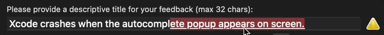
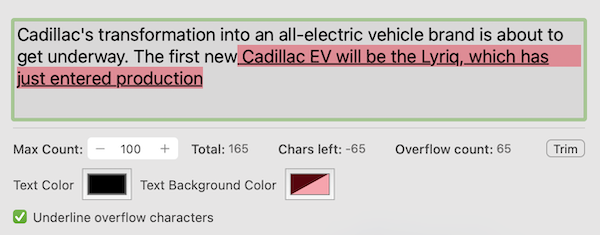

# DSFMaxLengthDisplayTextField

<p align="center">
    
    
    
    <a href="https://swift.org/package-manager">
        
    </a>
</p>
<p align="center">

An `NSTextField` that specifies a maximum count after which text is highlighted to indicate an overflow





## Why?

I always liked the Twitter approach for indicating that text was oversized - it allows you to easily curate your content appropriately to fit the available size.

## API

This control uses the concept of a "grapheme cluster" for its character count - this means that emojis/complex characters represent a single character within the string

For example, the string `a=🧖🏼‍♀️, b=💆‍♂️, c=🙆🏾` represents 13 characters

| 1  | 2  | 3  | 4  | 5  | 6  | 7  | 8  | 9  | 10 | 11 | 12 | 13 |
|----|----|----|----|----|----|----|----|----|----|----|----|----|
| a | = | 🧖🏼‍♀️ | , |   | b | = | 💆‍♂️ | , |   | c | = | 🙆🏾 |

<!-- **Note:** In UTF8, this length is 48, UTF16 the length is 26 -->

### Settable properties

| Property                      | Type      | Description                                           |
|-------------------------------|-----------|-------------------------------------------------------|
| `maxCharacters`               | `Int`     | The maximum number of characters allowed              |
| `overflowTextColor`           | `NSColor` | The color to use for 'overflow' characters            |
| `overflowTextBackgroundColor` | `NSColor` | The background color to use for 'overflow' characters |
| `underlineOverflowCharacters` | `Bool`    | Whether to underline overflow characters              |

### Observable properties

These properties are KVO observable.

| Property                      | Type   | Description                                               |
|-------------------------------|--------|-----------------------------------------------------------|
| `isValid`                     | `Bool` | Does the text fit within the maximum characters specified |
| `characterCount`              | `Int`  | Total character count                                     |
| `charactersAvailable`         | `Int`  | The number of characters available before overflow occurs |
| `overflowCharacterCount`      | `Int`  | The number of overflow characters                         |

### Callbacks

| Parameter                  | Type             | Description                        |
|----------------------------|------------------|------------------------------------|
| `contentChangedCallback`   | `() -> Void`     | Called when the content changes    |
| `isValidChangedCallback`   | `(Bool) -> Void` | Called when the validity changes   |

### Combine (macOS 10.15+)

| Parameter            | Description                                      |
|----------------------|--------------------------------------------------|
| `validityPublisher`  | Publishes when the validity of the field changes |

<details>
<summary>Combine Example Usage</summary>

```swift
@IBOutlet weak var titleField: DSFMaxLengthDisplayTextField!
...
titleField.validityPublisher
   .removeDuplicates()
   .sink { newValue in
      Swift.print("Title Validity changed: \(newValue)")
   }
```

</details>

## License

```
MIT License

Copyright (c) 2022 Darren Ford

Permission is hereby granted, free of charge, to any person obtaining a copy
of this software and associated documentation files (the "Software"), to deal
in the Software without restriction, including without limitation the rights
to use, copy, modify, merge, publish, distribute, sublicense, and/or sell
copies of the Software, and to permit persons to whom the Software is
furnished to do so, subject to the following conditions:

The above copyright notice and this permission notice shall be included in all
copies or substantial portions of the Software.

THE SOFTWARE IS PROVIDED "AS IS", WITHOUT WARRANTY OF ANY KIND, EXPRESS OR
IMPLIED, INCLUDING BUT NOT LIMITED TO THE WARRANTIES OF MERCHANTABILITY,
FITNESS FOR A PARTICULAR PURPOSE AND NONINFRINGEMENT. IN NO EVENT SHALL THE
AUTHORS OR COPYRIGHT HOLDERS BE LIABLE FOR ANY CLAIM, DAMAGES OR OTHER
LIABILITY, WHETHER IN AN ACTION OF CONTRACT, TORT OR OTHERWISE, ARISING FROM,
OUT OF OR IN CONNECTION WITH THE SOFTWARE OR THE USE OR OTHER DEALINGS IN THE
SOFTWARE.
```
